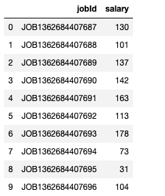
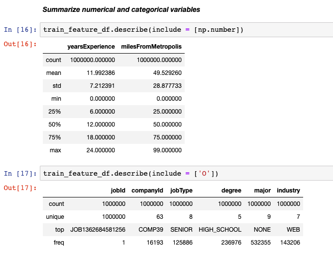
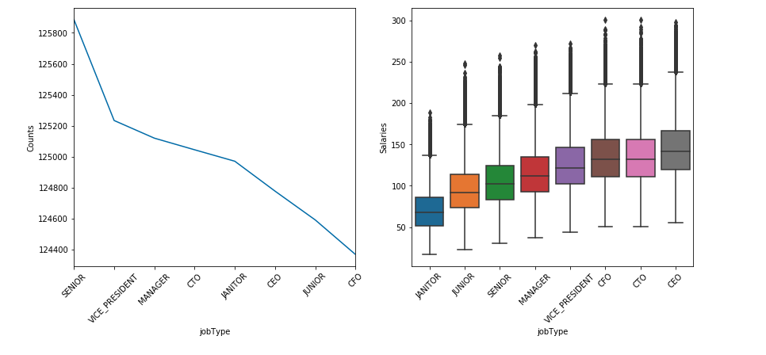
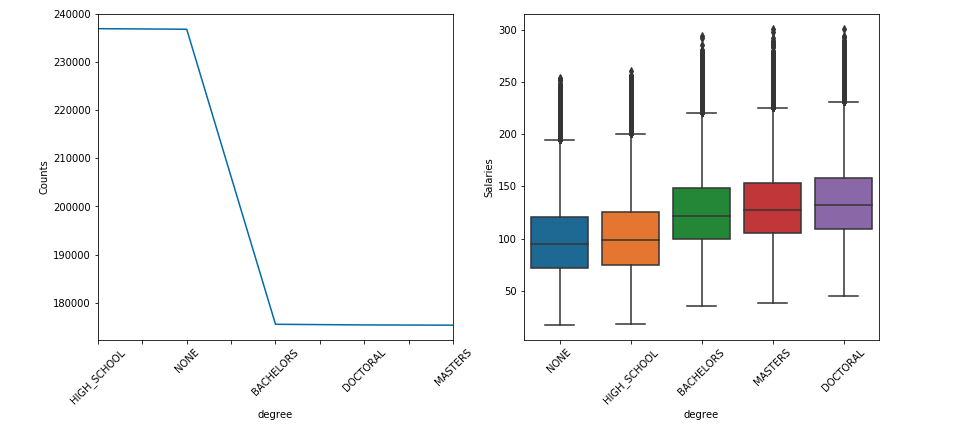
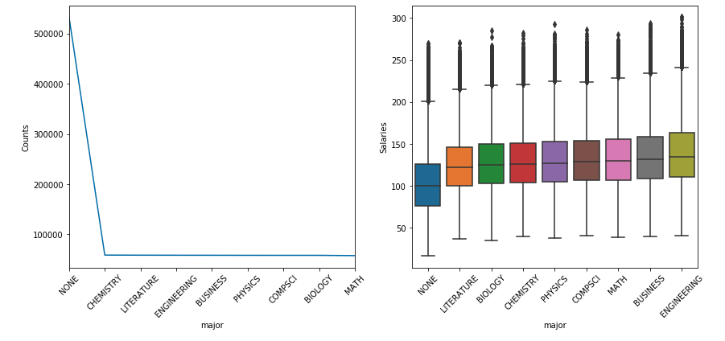
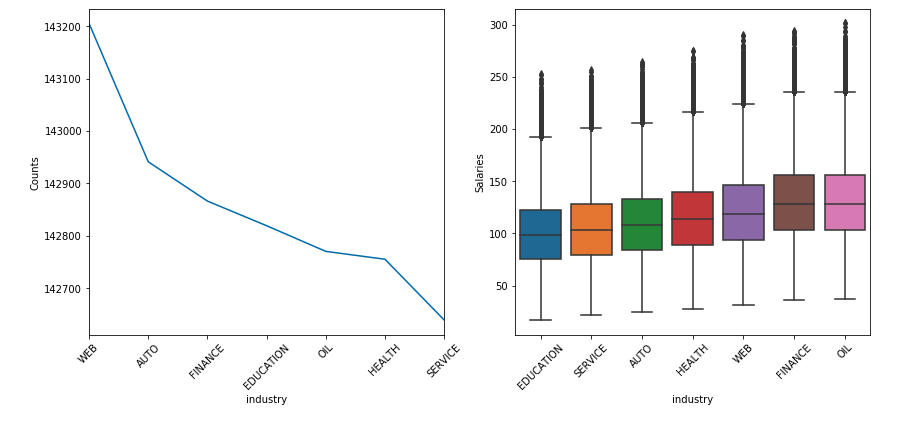
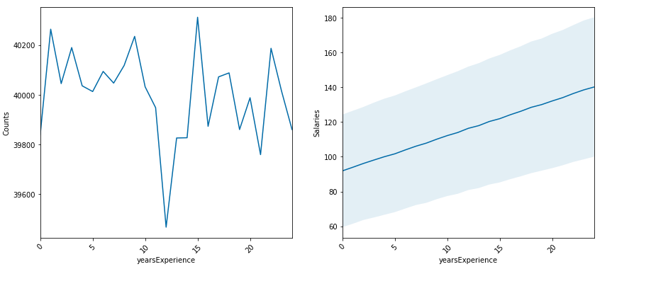
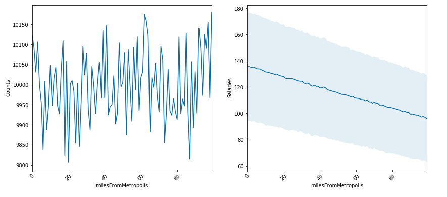
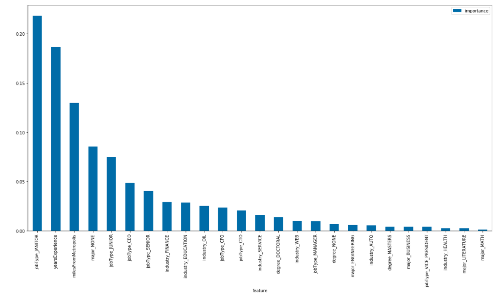

# Salary-Prediction

## Table of contents

- [Purpose](#Purpose)
- [Technologies](#technologies)
- [Dataset](#dataset)
- [Methodology](#methodology)

## Purpose

This project is examine a set of job postings with salaries and then predict salaries for a new set of job postings.

## Technologies

Python

## Dataset

The dataset used has the following columns:
 
 
jobId: Unique identifier for each employee 
 
salary: Annual salary 
 
companyId: Identifier for each company 
 
jobType: Position held within the company (CEO, CFO, CTO, Vice President, Manager, Janitor, Senior, or Junior) 
 
degree: Doctoral, Masters, Bachelors, High School, or None
 
major: field of study 
 
industry: field of work 
 
yearsExperience: how many years of work experience 
 
milesFromMetropolis: miles away the job is from a major city
 
 
   

## Methodology

1. Exploratory Data Analysis: 
Summarized data and created plots for each category as seen in the diagrams below: 
Data Summary: 
  

Job Type: There is a clear positive correlation between job type and salary.  
  

Degree: People with higher degrees have higher salaries.  
  

Major: Engineering major have higher salaries.  
  

Industry: Oil and Finance industries have the same salaries and pay better compared to other industries.  
  

Years of experience:There is a clear correlation between salary and years of experience.  
  

Miles from metropolis: Salary decreases with distance from major cities.  
  

Heatmap: 
  

2. Model Building and Evaluation: 
Created 4 different models then chose the model with the lowest MSE. 
- Linear Regression => MSE:384.46  
- Pipeline => MSE:384.46  
- Random Forest Regressor => MSE:367.74  
- Gradient Boosting Regressor => MSE:357.23  
 
 
   As seen on the image below, the job type janitor has the highest importance meaning lowest salary. 
    
