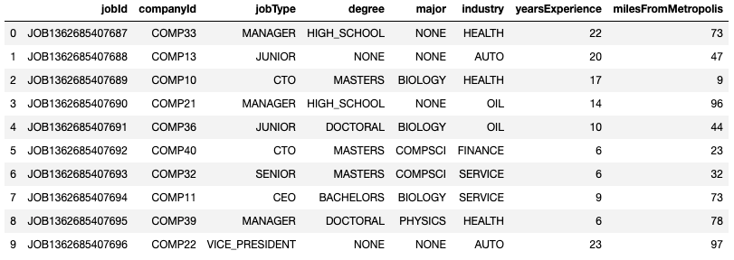

# Salary-Prediction

## Table of contents

- [Purpose](#Purpose)
- [Technologies](#technologies)
- [Dataset](#dataset)
- [Methodology](#methodology)

## Purpose

This project is examine a set of job postings with salaries and then predict salaries for a new set of job postings.

## Technologies

Python

## Dataset

The dataset used has the following columns:
 
*jobId:* Unique identifier for each employee 
 
*salary:* Annual salary 
 
*companyId:* Identifier for each company 
 
*jobType:* Position held within the company (CEO, CFO, CTO, Vice President, Manager, Janitor, Senior, or Junior) 
 
*degree:* Doctoral, Masters, Bachelors, High School, or None
 
*major:* field of study 
 
*industry:* field of work 
 
*yearsExperience:* how many years of work experience 
 
*milesFromMetropolis:* miles away the job is from a major city
  

## Methodology

1. _Exploratory Data Analysis: 
Summarized data and created plots for each category as seen in the diagrams below: 
Data Summary: 
  

Job Type: 
  

Degree: 
  

Major: 
  

Industry: 
  

Years of experience: 
  

Heatmap: 
  

2. _Model Building and Evaluation: 
Created 4 different models then chose the model with the lowest MSE.
- Linear Regression => MSE:384.46  
- Pipeline => MSE:384.46  
- Random Forest Regressor => MSE:367.74  
- Gradient Boosting Regressor => MSE:357.23  
   As seen on the image below, the job type janitor has the highest importance meaning lowest salary. 
    
